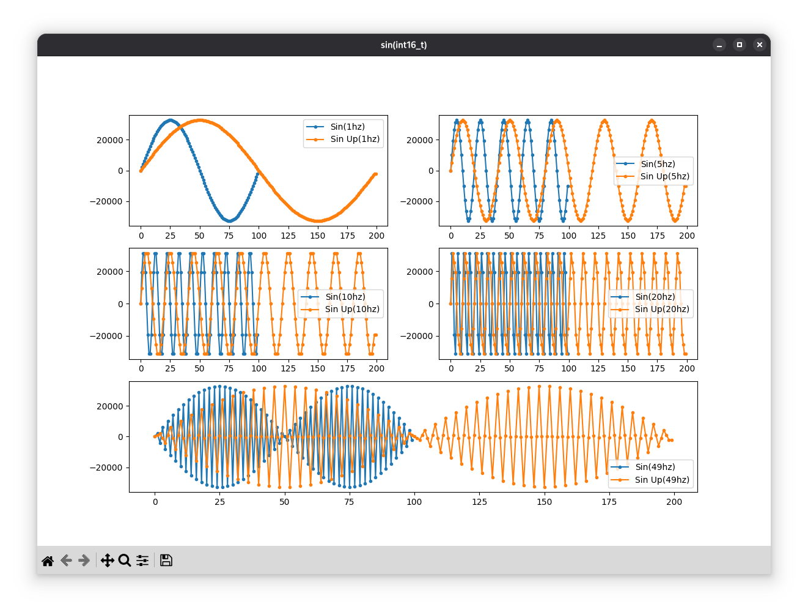

# Тестовое задание YADRO

## Структура
- `include` - заголовочные файлы
- `src` - исполняемые файлы
- `CMakeLists.txt` - для сборки C++ проекта

Файл `src/main.py` для визуализации полученых данных.

## Старт
Создайте `build` в корне проекта:
```
mkdir -p build && cd build
```

Соберите проект:
```
cmake .. && clear && cmake --build . -j && ./main
```

В `/build` появится `output.csv`

Теперь можно создать виртуальное окружение для Python. Из корня проекта:
```
python3 -m venv .venv
source .venv/bin/activate
pip install -r requirements.txt
```

И запустить: `python src/main.py`

## Результаты

При запуске `main.cpp` получаем следущий вывод в консоль:
```
MAE квантования(float -> int16_t): 1.57746e-05

Зависимость ошибки upsameple при разных значения частоты сигнала(float):
1 Hz -> MAE: 0.000313916
5 Hz -> MAE: 0.00468837
10 Hz -> MAE: 0.0171566
20 Hz -> MAE: 0.0600337
49 Hz -> MAE: 0.308205

Зависимость ошибки upsameple при разных значения частоты сигнала(int16_t):
1 Hz -> MAE: 0.000334086
5 Hz -> MAE: 0.00470097
10 Hz -> MAE: 0.017173
20 Hz -> MAE: 0.0600475
49 Hz -> MAE: 0.308216
```

### Выводы
Какие выводы можно сделать:
- Ошибка квантования MAE(Mean Absolut Error) из float -> int16_t есть, но небольшая, примерно 0.0000157746
- Также видно, что при повышении частоты дискретизации через линейную интерполяции, падает точность сигнала, т.к чем быстрее изменяется синус, тем кривее его сигнал, линейная интерполяция не может точно повторять его значения.

Точность интерполяции я оцениваю так:
- Генерирую эталонный сигнал напрямую при fs = 200 Гц
- Генерирую сигнал при fs = 100 Гц и применяю upsampler (fs = 100 → 200)
- Считаю MAE между эталоном и upsampled сигналом для частот 1, 5, 10, 20, 49 Гц

### Графики


